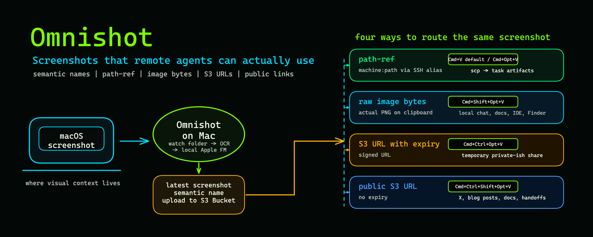
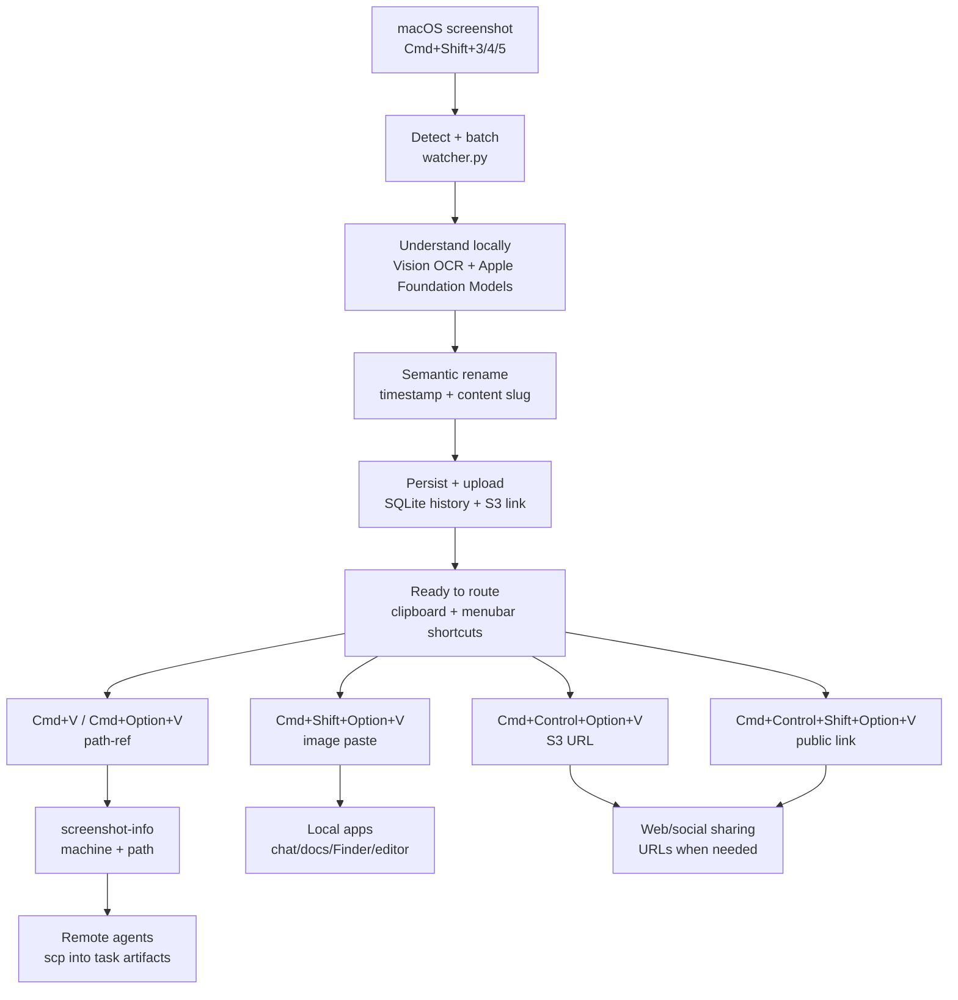
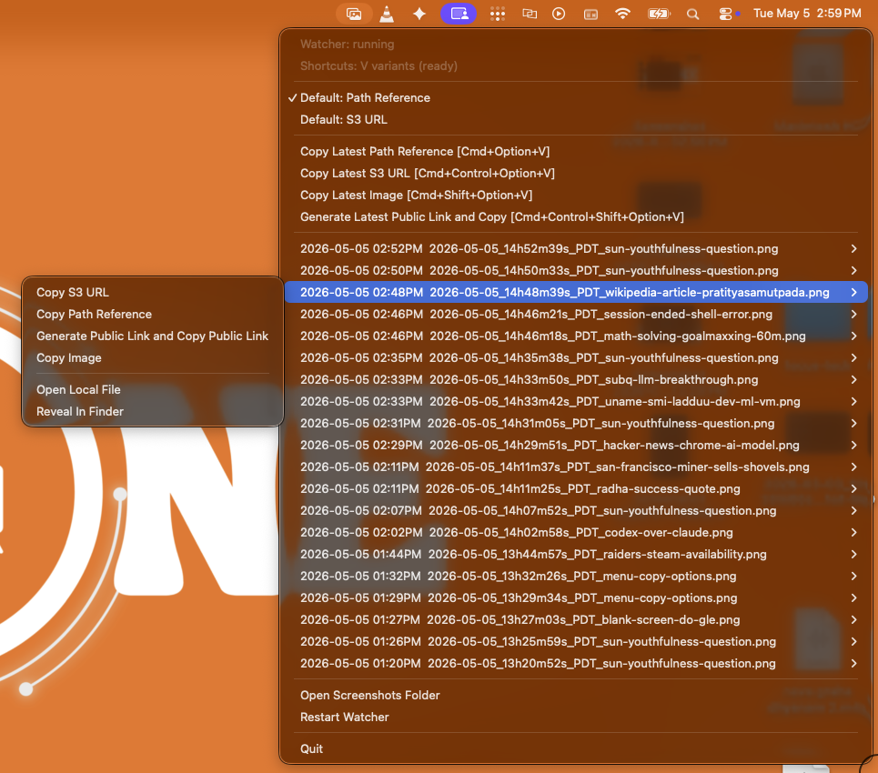
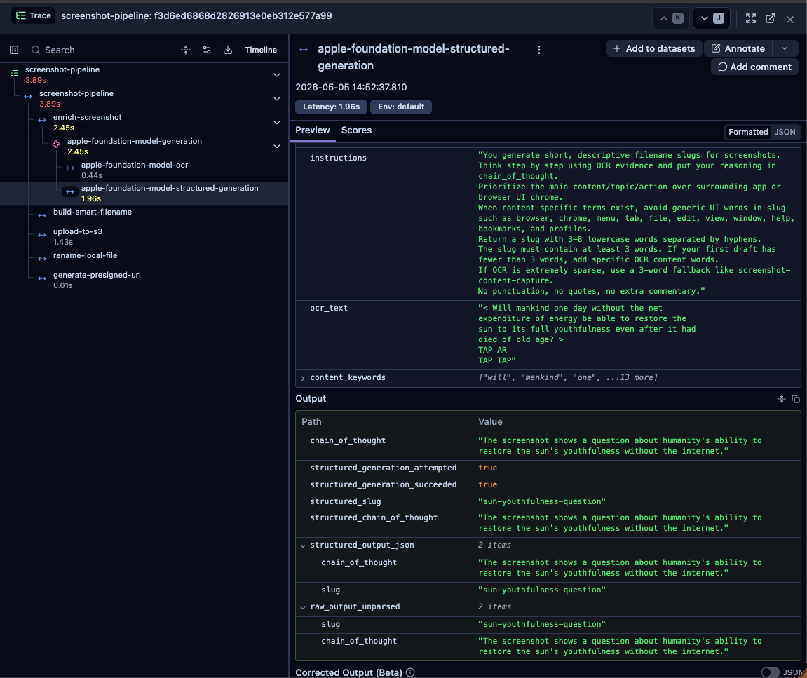
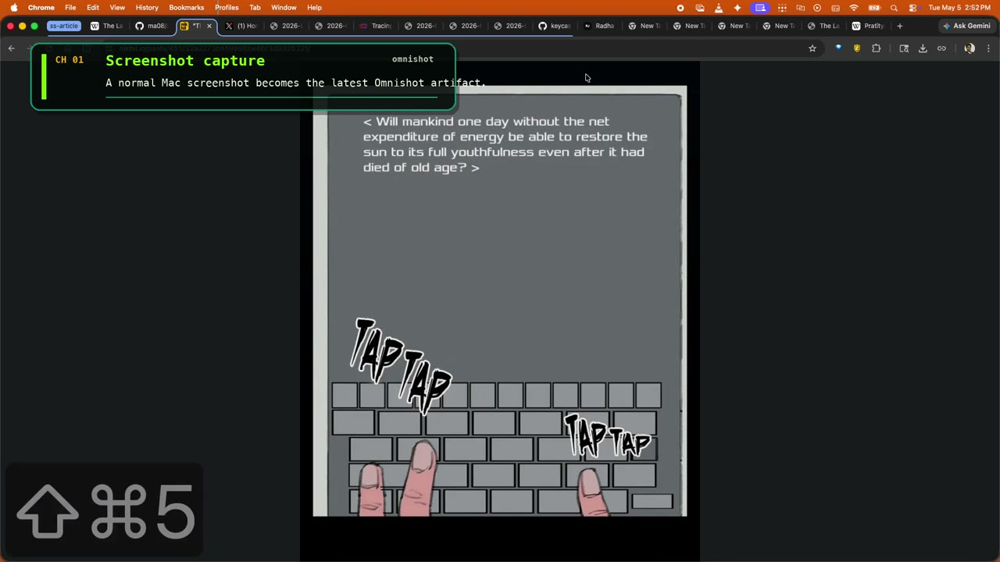
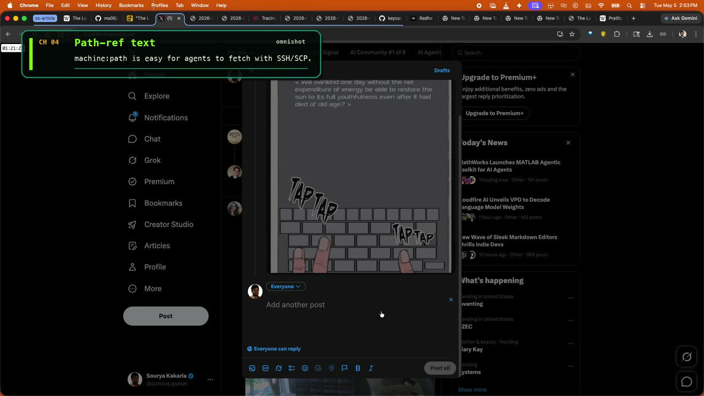
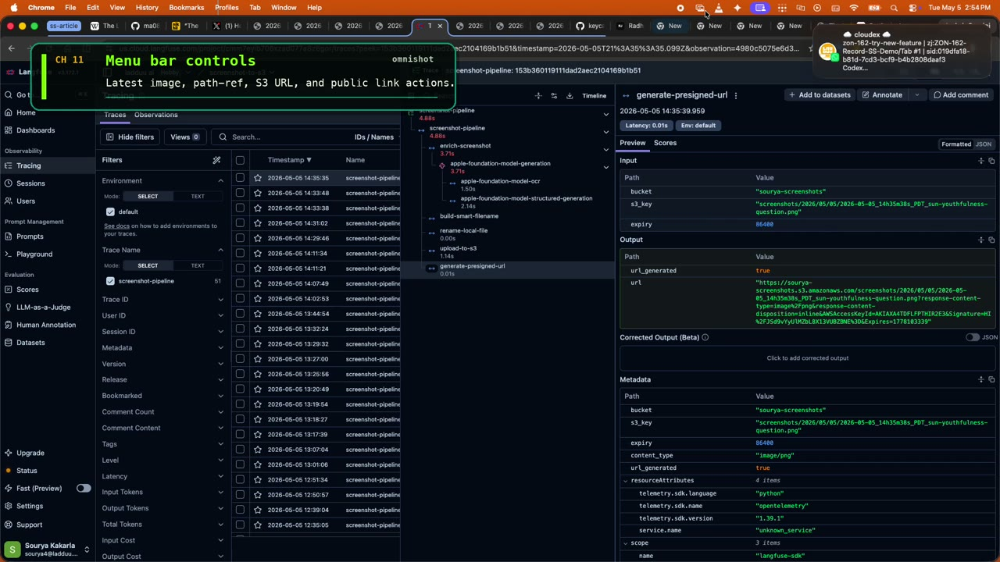
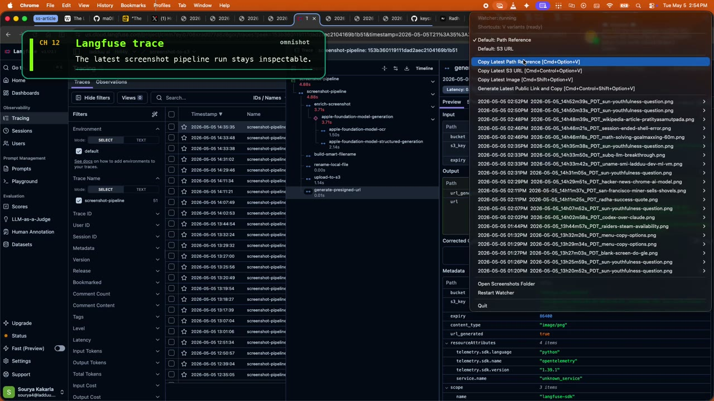
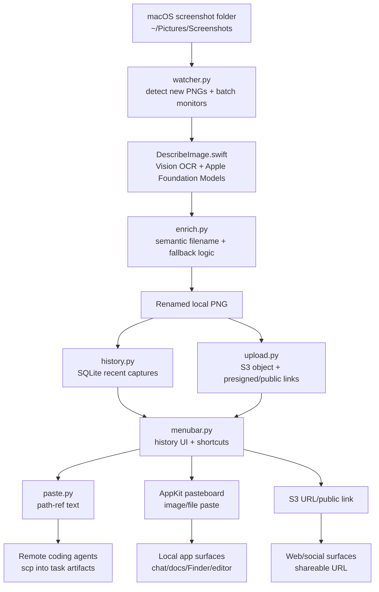

# Omnishot

Semantic macOS screenshots for agentic engineering.

Read the launch article: [Making Screenshots Agent-Native in Remote Workspaces](https://x.com/curious_queue/status/2051832335973364102?s=20).

Watch the walkthrough thread: [Omnishot screenshot routing demos](https://x.com/curious_queue/status/2052106783590961660?s=20).

[](https://x.com/curious_queue/status/2051832335973364102?s=20)

This is a small macOS utility that turns a normal screenshot into a named,
routeable artifact:

- semantic local filename from Apple Vision OCR + Apple Foundation Models
- compact `screenshot-info` payload for remote agents over SSH
- direct image paste for chat apps, docs, Finder, Cursor, and VS Code
- S3/public links when a URL is the right transport

It is public as a reference implementation, not a polished product. The useful
parts to copy are the workflow shape, paste-mode contract, machine alias
convention, and agent instructions.

## Ask Your Agent To Adapt This Repo

Paste this into your coding agent before deciding what to copy:

```text
Read through https://github.com/ma08/omnishot and help me adapt
the screenshot workflow to my own machine setup.

Focus on reusable patterns, not copying the repo author's machine-specific config.

Ask me targeted questions about:
- where my screenshots land
- whether I use local or remote coding agents
- my SSH aliases between machines
- whether I need S3/public links or only local SSH transfer
- what apps I paste screenshots into most often

Then recommend the smallest useful version I should implement.
```

## Workflow At A Glance



The core abstraction is:

```text
screenshot -> named artifact -> route to the current surface
```

S3 is one transport, not the whole point.

## Visual Walkthrough

The menu bar keeps the latest screenshot actions inspectable even when keyboard
shortcuts are faster.

<p align="center">
  
</p>

The local naming and upload pipeline is observable, so failures are not hidden
inside a background watcher.

<p align="center">
  
</p>

## Why It Exists

Taking screenshots is easy. Getting a screenshot into the right agent, on the
right machine, with a useful filename and durable task context, is still awkward.

Before:

```text
Screenshot 2026-02-23 at 9.43.31 PM.png
```

After:

```text
2026-02-23_21h43m40s_PST_cursor-settings-heavy-memory.png
```

Default agent payload:

```text
screenshot-info:
  machine: work-mac
  path: /Users/alex/Pictures/Screenshots/2026-05-05_08h36m35s_PDT_dashboard-error-state.png
```

A remote agent can then copy the image into its task folder:

```bash
scp 'work-mac:/Users/alex/Pictures/Screenshots/example.png' user_inputs/input_artifacts/
```

## Quick Start

```bash
git clone https://github.com/ma08/omnishot.git
cd omnishot
uv sync

# Required for uploads and URL paste modes
export OMNISHOT_BUCKET=your-bucket-name

# Optional, recommended on supported macOS versions
./scripts/build-swift.sh

# Recommended runtime
uv run omnishot menubar
```

## Paste Modes

| Shortcut | Payload |
|----------|---------|
| `Cmd+V` | configured default after capture, `path-ref` by default |
| `Cmd+Option+V` | latest path reference (`screenshot-info`) |
| `Cmd+Shift+Option+V` | latest image directly |
| `Cmd+Control+Option+V` | latest S3 URL |
| `Cmd+Control+Shift+Option+V` | latest public link |

Configure the machine token with:

```bash
export BOT_MACHINE_SSH_ALIAS=work-mac
```

or pass `--ssh-host-hint work-mac`.

## Agent Instructions

The compact payload works best when your global agent instructions teach agents
what to do with it:

- treat `machine` as an SSH alias
- copy the referenced image into the active task's `user_inputs/input_artifacts/`
- index the artifact before relying on it

Reference implementation: [botfiles PR #23](https://github.com/ma08/botfiles/pull/23)
adds this behavior to global Codex/Claude instructions.

## Demo Clips

The full walkthrough thread is on X: [Omnishot screenshot routing demos](https://x.com/curious_queue/status/2052106783590961660?s=20).

GitHub does not consistently render repository-local MP4s inline in README
pages, so each preview image below links to a browser-playable hosted clip.

<table>
  <tr>
    <td align="center" width="50%">
      <a href="https://sourya-screenshots.s3.amazonaws.com/omnishot/readme/clips/clip-capture-and-remote-retrieval.mp4">
        
      </a><br>
      <strong>Capture + remote retrieval</strong><br>
      <sub>Mac screenshot -> path-ref paste -> VM copies image into task artifacts.</sub><br>
      <a href="https://sourya-screenshots.s3.amazonaws.com/omnishot/readme/clips/clip-capture-and-remote-retrieval.mp4">Watch clip</a>
    </td>
    <td align="center" width="50%">
      <a href="https://sourya-screenshots.s3.amazonaws.com/omnishot/readme/clips/clip-paste-routes-montage.mp4">
        
      </a><br>
      <strong>Paste routes montage</strong><br>
      <sub>Path-ref, signed S3 URL, public URL, picker access, and link checks.</sub><br>
      <a href="https://sourya-screenshots.s3.amazonaws.com/omnishot/readme/clips/clip-paste-routes-montage.mp4">Watch clip</a>
    </td>
  </tr>
  <tr>
    <td align="center" width="50%">
      <a href="https://sourya-screenshots.s3.amazonaws.com/omnishot/readme/clips/clip-menu-bar-controls.mp4">
        
      </a><br>
      <strong>Menu bar controls</strong><br>
      <sub>Latest image, path-ref, S3 URL, and public link actions.</sub><br>
      <a href="https://sourya-screenshots.s3.amazonaws.com/omnishot/readme/clips/clip-menu-bar-controls.mp4">Watch clip</a>
    </td>
    <td align="center" width="50%">
      <a href="https://sourya-screenshots.s3.amazonaws.com/omnishot/readme/clips/clip-langfuse-trace.mp4">
        
      </a><br>
      <strong>Langfuse trace</strong><br>
      <sub>Pipeline observability for screenshot naming and upload.</sub><br>
      <a href="https://sourya-screenshots.s3.amazonaws.com/omnishot/readme/clips/clip-langfuse-trace.mp4">Watch clip</a>
    </td>
  </tr>
</table>

## Docs

- [Usage](docs/usage.md) - setup, modes, shortcuts, launchd, CLI options
- [Agent instructions](docs/agent-instructions.md) - reusable `screenshot-info`
  handling for Codex/Claude-style agents
- [Architecture](docs/architecture.md) - pipeline diagram and data flow
- [Tech stack](docs/tech-stack.md) - exact implementation details and citations
- [Troubleshooting](docs/troubleshooting.md) - permissions, S3, clipboard, prompt evals
- [Contributing](CONTRIBUTING.md) - local checks and PR expectations

## Architecture At A Glance



## License

MIT
