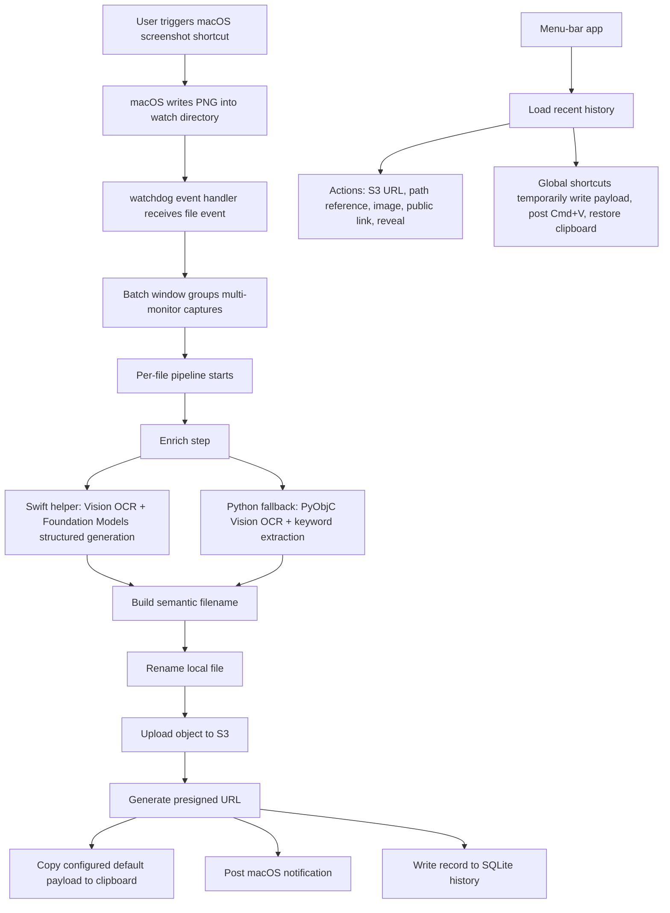

# Architecture



## Naming Pipeline

The primary path uses Apple Vision OCR and Apple Foundation Models through the
Swift helper in `swift/Sources/DescribeImage.swift`.

The fallback path uses Vision through PyObjC and deterministic keyword
extraction in `src/omnishot/enrich.py`.

## Routing Pipeline

The file is always kept locally. S3 and public links are optional transports.
The default post-capture payload is `path-ref`, which produces:

```text
screenshot-info:
  machine: <ssh-alias>
  path: <absolute-local-path>
```

Remote agents can copy that file over SSH into durable task artifacts. Local apps
can use the direct image paste path instead.

## Data Stores

- History: `~/Library/Application Support/omnishot/history.db`
- Menubar config: `~/Library/Application Support/omnishot/config.json`

The app-support path is intentionally scoped to Omnishot so local history and
menu-bar settings stay separate from earlier experiments.
